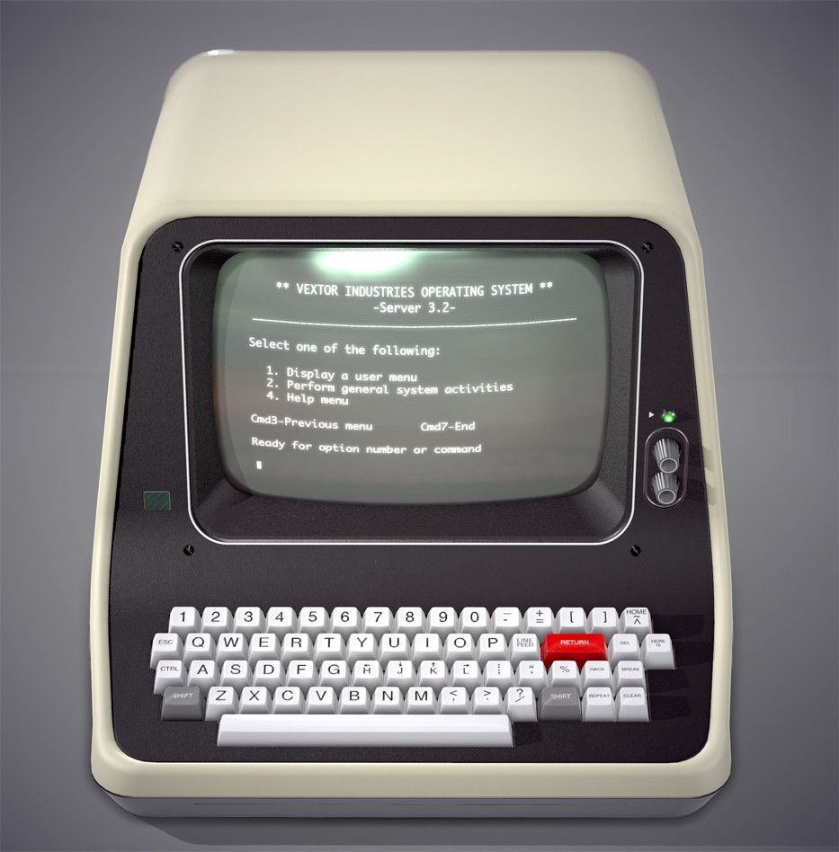
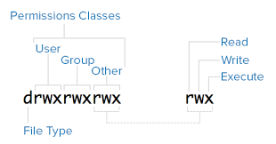

<div align="center">

# `linux`

<h3>
    Linux est un système d'exploitation open-source. Ce dépôt propose une introduction à ses commandes, à son système de fichiers et aux tâches d'administration de base.
</h3>

<!-- Badges -->


<!-- Demo image -->


</div>

<!-- TABLE OF CONTENTS -->

## Table des Matières

- [Présentation de Linux 🌐](#présentation-de-linux)

  - [Qu’est-ce que Linux ?](#quest-ce-que-linux)
  - [Pourquoi choisir Linux ?](#pourquoi-choisir-linux)

- [Introduction aux Fondamentaux de Linux 🛠️](#introduction-aux-fondamentaux-de-linux)

  - [Installation de Linux](#installation-de-linux)
  - [Découverte de l’Environnement](#découverte-de-lenvironnement)
  - [Introduction au Terminal](#introduction-au-terminal)

- [Commandes Essentielles sous Linux 📜](#commandes-essentielles-sous-linux)

  - [Navigation dans le Système de Fichiers](#navigation-dans-le-système-de-fichiers)
  - [Gestion des Fichiers et Répertoires](#gestion-des-fichiers-et-répertoires)
  - [Lecture et Modification des Fichiers](#lecture-et-modification-des-fichiers)

- [Architecture et Organisation du Système de Fichiers 📂](#architecture-et-organisation-du-système-de-fichiers)

  - [Hiérarchie des Répertoires](#hiérarchie-des-répertoires)
  - [Permissions et Propriétés des Fichiers](#permissions-et-propriétés-des-fichiers)

- [Gestion des Logiciels et des Paquets 📦](#gestion-des-logiciels-et-des-paquets)

  - [Installation et Suppression de Logiciels](#installation-et-suppression-de-logiciels)
  - [Mise à Jour et Maintenance du Système](#mise-à-jour-et-maintenance-du-système)

- [Administration des Utilisateurs et des Groupes 👤](#administration-des-utilisateurs-et-des-groupes)

  - [Création et Gestion des Comptes](#création-et-gestion-des-comptes)
  - [Gestion des Groupes et des Permissions](#gestion-des-groupes-et-des-permissions)

- [Concepts de Base en Réseaux 🌐](#concepts-de-base-en-réseaux)

  - [Configuration Réseau](#configuration-réseau)
  - [Commandes Réseaux Courantes](#commandes-réseaux-courantes)

- [Supervision et Analyse du Système 📊](#supervision-et-analyse-du-système)

  - [Gestion des Processus](#gestion-des-processus)
  - [Surveillance des Performances](#surveillance-des-performances)

- [Introduction au Scripting Shell 💻](#introduction-au-scripting-shell)

  - [Écriture de Scripts Simples](#écriture-de-scripts-simples)
  - [Utilisation des Variables et Boucles](#utilisation-des-variables-et-boucles)

- [Ateliers Pratiques et Applications Réelles 🛠️](#ateliers-pratiques-et-applications-réelles)
  - [Exercices Dirigés](#exercices-dirigés)
  - [Création d’un Projet Linux Personnel](#création-dun-projet-linux-personnel)

# Présentation de Linux 🌐

## Qu’est-ce que Linux ?

Linux est un système d'exploitation open-source créé par Linus Torvalds en 1991. Il est utilisé dans divers domaines, des serveurs aux appareils mobiles, grâce à sa stabilité, sa sécurité et sa flexibilité. Linux est distribué sous une licence libre, permettant à chacun de modifier et redistribuer son code.

## Pourquoi choisir Linux ?

- **Open Source et Gratuit** : Linux est gratuit et modifiable, ce qui permet de l'adapter à ses besoins.
- **Stabilité et Fiabilité** : Linux est stable, mais certaines distributions comme Arch Linux peuvent être moins stables, contrairement à Debian qui est reconnu pour sa fiabilité.
- **Sécurité** : Linux offre une sécurité robuste, mais cela dépend aussi de l'utilisateur et de la gestion des permissions.
- **Communauté et Support** : La communauté Linux est active et propose des ressources utiles comme [Arch Wiki](https://wiki.archlinux.org) et [Debian Wiki](https://wiki.debian.org) pour l'aide et la documentation.
- **Meilleur choix pour les Développeurs** : Linux est très apprécié des développeurs grâce à ses outils et sa flexibilité.
- **Flexibilité** : Linux fonctionne sur une large gamme de matériel, des anciens ordinateurs aux serveurs modernes.
- **Opportunité d'Apprentissage** : Utiliser Linux permet de mieux comprendre le fonctionnement des systèmes d'exploitation.

# Introduction aux Fondamentaux de Linux 🛠️

## Installation de Linux

L'installation de Linux peut être simple et se faire en plusieurs étapes. Voici comment procéder :

1. **Choisissez une distribution Linux** : Nous vous recommandons [Ubuntu](https://ubuntu.com/download) pour les débutants. C’est une distribution populaire avec une grande communauté.
2. **Téléchargez l’image ISO** : Allez sur le site d'Ubuntu et téléchargez le fichier ISO pour commencer l'installation.
3. **Préparez votre matériel** : Vous pouvez installer Ubuntu directement sur votre ordinateur ou utiliser une machine virtuelle comme [VirtualBox](https://www.virtualbox.org/).
4. **Suivez les instructions d'installation** : Si vous choisissez Ubuntu, consultez le [guide officiel d'installation](https://ubuntu.com/tutorials/install-ubuntu-desktop#1-overview) pour vous aider tout au long du processus.

Voici deux images utiles pour visualiser l'installation :

[](https://ubuntu.com/download) [](https://www.virtualbox.org/wiki/Downloads)

## Découverte de l’Environnement

Une fois installé, vous découvrirez un environnement graphique ou un bureau, selon la distribution choisie. Vous pourrez explorer les applications disponibles et vous familiariser avec les paramètres de votre système.

## Introduction au Terminal

Le terminal est un outil fondamental dans Linux, permettant d'exécuter des commandes pour interagir directement avec le système. Il offre une méthode rapide et efficace de contrôler le système, surtout pour les tâches répétitives ou avancées. Contrairement aux interfaces graphiques, où vous cliquez pour effectuer des actions, le terminal permet de tout faire via des lignes de commande.

Le terminal est particulièrement utile pour les débutants car :

- **Simplicité** : Il permet d’accomplir de nombreuses tâches avec quelques commandes simples.
- **Puissance** : Certaines opérations complexes, comme la gestion de fichiers ou l'installation de logiciels, sont plus rapides et plus faciles à réaliser via le terminal.
- **Contrôle total** : Le terminal offre un contrôle précis du système, ce qui est essentiel pour l'administration et la gestion des fichiers.

Historiquement, les premiers ordinateurs n'avaient pas d'interface graphique, et tout était contrôlé par des lignes de commande. Bien que les interfaces graphiques existent aujourd’hui, le terminal reste un outil incontournable pour les utilisateurs avancés et les administrateurs systèmes.

Voici une photo d'un ancien PC utilisé à l'époque des premiers systèmes :  


# Commandes Essentielles sous Linux 📜

## Navigation dans le Système de Fichiers

> "Le système de fichiers sous Linux est organisé en répertoires hiérarchiques. Utilisez ces commandes pour naviguer facilement."

- **`cd`** : Change de répertoire.
  - **`cd ~`** : Va directement dans le répertoire personnel de l'utilisateur.
  - **`cd ..`** : Reviens au répertoire parent.
  - **`cd /`** : Va à la racine du système de fichiers.
- **`pwd`** : Affiche le chemin complet du répertoire courant.
- **`ls`** : Liste les fichiers et répertoires présents dans le répertoire courant.
  - **`ls -l`** : Affiche la liste détaillée avec des informations supplémentaires (comme les permissions, la taille).
  - **`ls -a`** : Affiche les fichiers cachés.

## Gestion des Fichiers et Répertoires

> "Ces commandes vous permettent de manipuler des fichiers et répertoires sous Linux."

- **`cp`** : Copie un fichier ou un répertoire.
- **`mv`** : Déplace ou renomme un fichier ou un répertoire.
- **`rm`** : Supprime un fichier.
  - **`rm -r`** : Supprime un répertoire et son contenu.
- **`mkdir`** : Crée un nouveau répertoire.
- **`rmdir`** : Supprime un répertoire vide.
- **`touch`** : Crée un fichier vide ou met à jour un fichier existant.

## Lecture et Modification des Fichiers

> "Ces commandes permettent de lire et modifier les fichiers sous Linux."

- **`cat`** : Affiche le contenu d’un fichier.
- **`nano`** : Éditeur de texte simple en ligne de commande.
- **`vim`** : Éditeur de texte avancé.
- **`less`** : Permet de lire le contenu d’un fichier page par page.
- **`head`** : Affiche les premières lignes d’un fichier.
- **`tail`** : Affiche les dernières lignes d’un fichier.
  - **`tail -f`** : Affiche en temps réel les ajouts à la fin d’un fichier.
- **`grep`** : Recherche une chaîne de caractères dans un fichier.
- **`sed`** : Permet de modifier des fichiers de manière non interactive.

## Commandes Utiles

| **Commande**  | **Description**                                                                        |
| ------------- | -------------------------------------------------------------------------------------- |
| **`man`**     | Affiche le manuel d'une commande.                                                      |
| **`ps`**      | Affiche les processus en cours d'exécution.                                            |
| **`top`**     | Affiche en temps réel les processus en cours.                                          |
| **`free`**    | Affiche l’utilisation de la mémoire.                                                   |
| **`df`**      | Affiche l’espace disque utilisé et disponible.                                         |
| **`du`**      | Affiche la taille des fichiers ou répertoires.                                         |
| **`chmod`**   | Change les permissions d’un fichier.                                                   |
| **`chown`**   | Change le propriétaire d’un fichier.                                                   |
| **`chgrp`**   | Change le groupe d’un fichier.                                                         |
| **`tar`**     | Crée ou extrait des archives (par exemple `.tar`, `.tar.gz`).                          |
| **`wget`**    | Télécharge des fichiers à partir du web.                                               |
| **`curl`**    | Transfère des données depuis ou vers un serveur.                                       |
| **`kill`**    | Envoie un signal pour arrêter un processus.                                            |
| **`exit`**    | Quitte le terminal ou un shell.                                                        |
| **`history`** | Affiche l'historique des commandes utilisées.                                          |
| **`alias`**   | Crée un raccourci pour une commande.                                                   |
| **`uname`**   | Affiche des informations sur le système d’exploitation.                                |
| **`uptime`**  | Affiche depuis combien de temps le système est en fonctionnement.                      |
| **`whoami`**  | Affiche le nom de l'utilisateur courant.                                               |
| **`htop`**    | Version améliorée de `top`, pour afficher les processus avec une interface plus riche. |

**Note :**  
Le flag **`--help`** (ou **`-h`**) est un flag très courant dans de nombreuses commandes Linux. Il affiche l’aide et les options disponibles pour une commande spécifique. Exemple : `ls --help` ou `ps --help`.

# Architecture et Organisation du Système de Fichiers 📂

## Hiérarchie des Répertoires

> "Le système de fichiers Linux est organisé sous forme d'une hiérarchie avec la racine `/` à la base."

- **`/`** : Racine du système.
- **`/home`** : Répertoires personnels des utilisateurs.
- **`/bin`** : Commandes essentielles, nécessaires au système.
- **`/etc`** : Fichiers de configuration système, comme les configurations réseau ou les paramètres de démarrage.
- **`/var`** : Contient les fichiers variables, tels que les journaux système, les fichiers temporaires, et les données des applications.
- **`/usr`** : Contient des programmes et des bibliothèques partagées qui ne sont pas essentiels au démarrage du système.
- **`/tmp`** : Répertoire pour les fichiers temporaires utilisés par les applications et le système.
- **`/dev`** : Contient les fichiers de périphériques qui représentent des ressources matérielles, comme des disques durs et des imprimantes.
- **`/mnt`** : Points de montage temporaires où vous pouvez monter des partitions ou des périphériques externes.
- **`/opt`** : Utilisé pour les logiciels tiers installés manuellement, souvent en dehors du système de gestion de paquets de la distribution.

## Permissions et Propriétés des Fichiers

> "Linux utilise un système de permissions pour contrôler l'accès aux fichiers."

Les permissions d'un fichier ou d'un répertoire sont attribuées à trois types d'utilisateurs : le propriétaire, le groupe et les autres utilisateurs. Voici les types de permissions :

- **`r`** : Lecture (read) — Permet de lire le fichier.
- **`w`** : Écriture (write) — Permet de modifier ou supprimer le fichier.
- **`x`** : Exécution (execute) — Permet d'exécuter le fichier.

### Système Octal des Permissions

Les permissions peuvent être représentées dans le système octal, qui est une méthode standard pour exprimer les permissions :

- **`rwx`** = 7 (lecture + écriture + exécution)
- **`rw-`** = 6 (lecture + écriture)
- **`r--`** = 4 (lecture seulement)
- **`wx-`** = 3 (exécution + écriture)
- **`x--`** = 1 (exécution seulement)
- **`---`** = 0 (aucune permission)

Exemples d'utilisation :

- **`chmod 755 fichier`** : Propriétaire (`rwx` = 7), groupe (`rx` = 5), autres (`rx` = 5).
- **`chmod 644 fichier`** : Propriétaire (`rw-` = 6), groupe (`r--` = 4), autres (`r--` = 4).

### Propriétaires et Groupes

- **Propriétaire** : Utilisateur qui possède le fichier.
- **Groupe** : Groupe d'utilisateurs auquel le fichier appartient.
- **Autres** : Tous les autres utilisateurs.



### Commande `chmod`

La commande **`chmod`** permet de modifier les permissions d'un fichier ou d'un répertoire.

- Exemple : **`chmod 755 fichier`** donne les permissions adéquates à chaque utilisateur.

# Gestion des Logiciels et des Paquets 📦

## Introduction aux Gestionnaires de Paquets

> "Les gestionnaires de paquets sont des outils essentiels pour gérer les logiciels sous Linux, facilitant l'installation, la mise à jour et la suppression des paquets."

Un gestionnaire de paquets est un outil qui permet aux utilisateurs de gérer les logiciels sur leur système. Ces outils interagissent avec des dépôts de logiciels pour télécharger et installer des paquets, mais aussi pour gérer les mises à jour et la suppression des logiciels. Chaque distribution Linux utilise généralement un gestionnaire de paquets propre, mais tous offrent des fonctionnalités similaires.

### Gestionnaires de Paquets Courants :

- **APT (Debian, Ubuntu, et dérivés)** : Un gestionnaire de paquets basé sur `dpkg` qui permet d'installer, de mettre à jour et de supprimer des paquets.
- **DNF (Fedora, CentOS, RHEL)** : Utilisé pour gérer les paquets sur les systèmes basés sur Red Hat.
- **PACMAN (Arch Linux et dérivés)** : Utilisé dans Arch Linux pour la gestion des paquets.
- **Zypper (openSUSE)** : Un gestionnaire de paquets pour les systèmes openSUSE.

Les gestionnaires de paquets sont souvent utilisés avec des commandes simples comme `install`, `remove`, et `update` pour gérer les logiciels.

## Installation et Suppression de Logiciels

> "Les gestionnaires de paquets permettent d'installer et de supprimer des logiciels en toute simplicité."

Voici comment utiliser les gestionnaires de paquets pour installer et supprimer des logiciels sur différentes distributions :

### Sur les systèmes basés sur Debian (comme Ubuntu) :

- `sudo apt install <package>` : Installe un paquet.
- `sudo apt remove <package>` : Supprime un paquet.
- `sudo apt purge <package>` : Supprime un paquet ainsi que ses fichiers de configuration.

### Sur les systèmes basés sur Red Hat (comme Fedora ou CentOS) :

- `sudo dnf install <package>` : Installe un paquet.
- `sudo dnf remove <package>` : Supprime un paquet.

### Sur les systèmes basés sur Arch (comme Arch Linux) :

- `sudo pacman -S <package>` : Installe un paquet.
- `sudo pacman -R <package>` : Supprime un paquet.

### Exemple pour installer un paquet avec `apt` :

```bash
sudo apt install curl

## Mise à Jour et Maintenance du Système
> "Mettre à jour votre système garantit que vous avez les dernières fonctionnalités et corrections de sécurité."

Il est crucial de maintenir votre système à jour. Voici comment effectuer les mises à jour et la maintenance sur différentes distributions :

### Sur les systèmes basés sur Debian (comme Ubuntu) :
- `sudo apt-get update` : Met à jour la liste des paquets disponibles.
- `sudo apt-get upgrade` : Met à jour tous les paquets installés vers leur dernière version.
- `sudo apt-get dist-upgrade` : Effectue une mise à jour complète du système, y compris les changements de dépendances et les mises à jour majeures.

### Sur les systèmes basés sur Red Hat (comme Fedora ou CentOS) :
- `sudo dnf update` : Met à jour tous les paquets installés.

### Sur les systèmes basés sur Arch (comme Arch Linux) :
- `sudo pacman -Syu` : Met à jour tous les paquets installés.

### Maintenance du système
- **Nettoyage des paquets inutilisés** :
  - Sur Debian/Ubuntu : `sudo apt-get autoremove`.
  - Sur Red Hat/Fedora : `sudo dnf autoremove`.
  - Sur Arch : `sudo pacman -Rns $(pacman -Qdtq)`.

Cela permet de supprimer les paquets qui ne sont plus nécessaires et de libérer de l'espace disque.

### Vérification de l'espace disque :
- `df -h` : Affiche l'utilisation de l'espace disque de toutes les partitions.
- `du -sh <directory>` : Affiche l'espace utilisé par un répertoire spécifique.

Enfin, pour vérifier les journaux système, ce qui peut être utile pour le dépannage et la gestion du système :
- `journalctl` : Affiche les journaux système.

## License 📑

- Please read [linux/LICENSE](https://github.com/nemo256/linux/blob/master/LICENSE)
```
